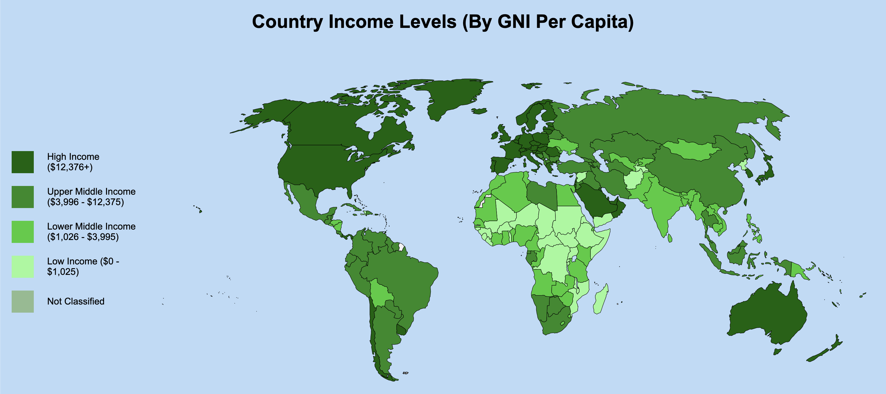

# Data Visualization Project

<a href="https://ayushgarg-ag.github.io/API-Data-Visualization-Project/" target="_blank"><i><b>View the live version here (on GitHub Pages)</i></b></a>

This repository includes a personal project of mine that retrieves real-time data of world development indicators from the World Bank using AJAX, unpacks and analyzes JSON data, and constructs a graphical visualization using an SVG.

The data is displayed using a combination of Javascript/AJAX, CSS, and HTML SVG's.

